

  
  <h1>Nectar</h1>
  
Nectar - E-Commerce Flutter Application (Online Grocery Store)

  

## Table of Contents

- [Introduction 🏛️](#introduction-🏛️)
- [Demo 🚀](#demo-🚀)
- [Features 🌟](#features-🌟)
- [Screenshots 📸](#screenshots-📸)
- [Packages Used 📚](#packages-used-📚)
- [Authors](#team-section)

  

## Introduction 🏛️

Nectar, our Flutter-based Online Grocery Store, offers a user-friendly interface for seamless shopping. It features essential functionalities like user authentication, product search, cart management, payments, favorites, and account settings. This app is made possible by the talented [Mina Saad](https://github.com/MinaSaad47)
behind the admin panel and backend server. A special thanks to him for his contribution.

[Learn more about our Backend and Admin Panel](https://github.com/MinaSaad47/groceries-monorepo)

  

## Demo 🚀

  

## Features 🌟

- +18 Screens
- Responsive UI
- API Integration
- Twilio integration (Phone Verify)
- Oauth2 with Google and JWT Authentication
- Bloc, Cubit and Hydrated Cubit State Management
- MVVM Design Pattern
- Stripe Integration (Payment Gateway)
- Localization
- Error Handling
- Pagination
- Google Maps integration
- GeoCoding Integration
- Cache
- Invoice PDF Generation
- Light & Dark Theme

  

## Screenshots 📸

<table>
  <tbody>
    <tr>
      <td align="center"></td>
      <td align="center"></td>
      <td align="center">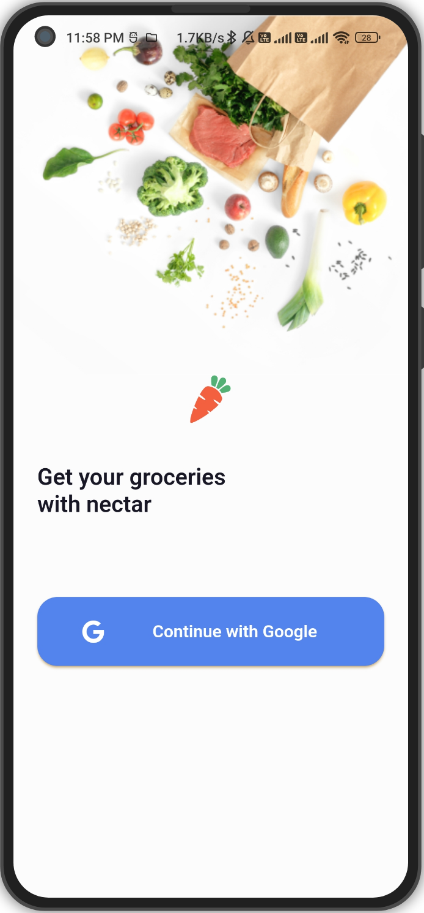</td>
    </tr>
    <tr>
      <td align="center"></td>
      <td align="center"></td>
      <td align="center"></td>
    </tr>
    <tr>
      <td align="center"></td>
      <td align="center">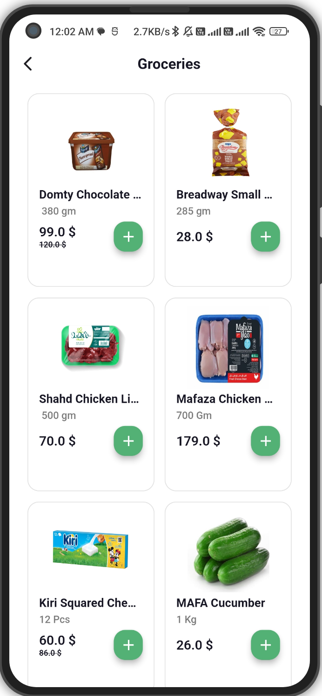</td>
      <td align="center">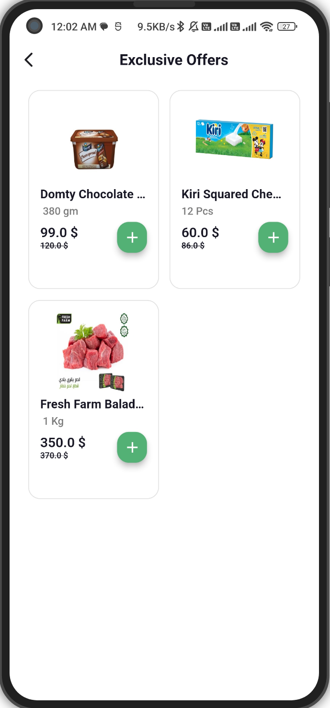</td>
    </tr>
    <tr>
      <td align="center">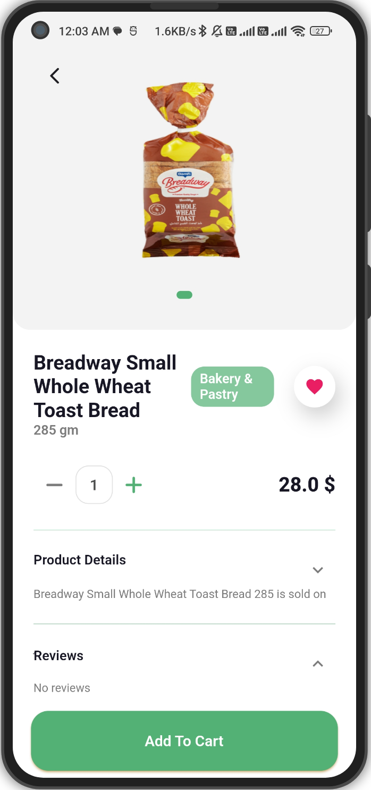</td>
      <td align="center">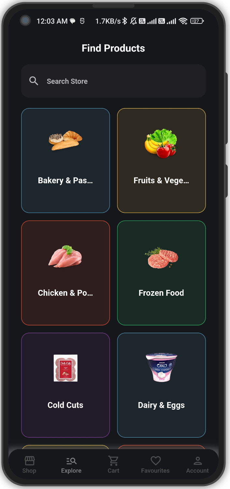</td>
      <td align="center">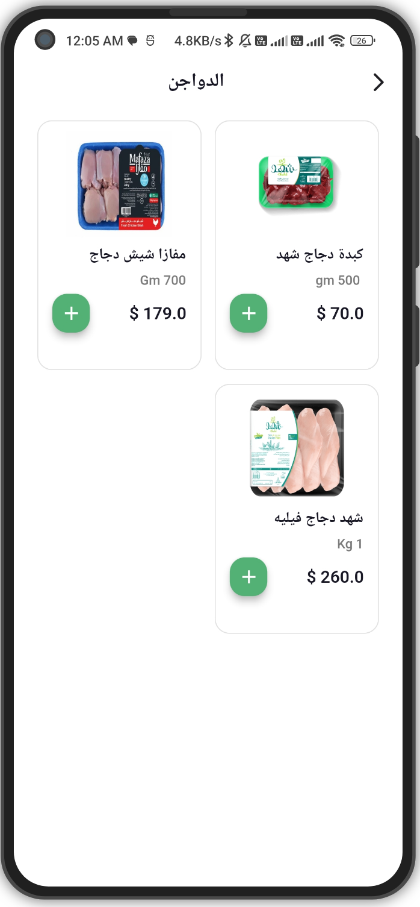</td>
    </tr>
    <tr>
      <td align="center">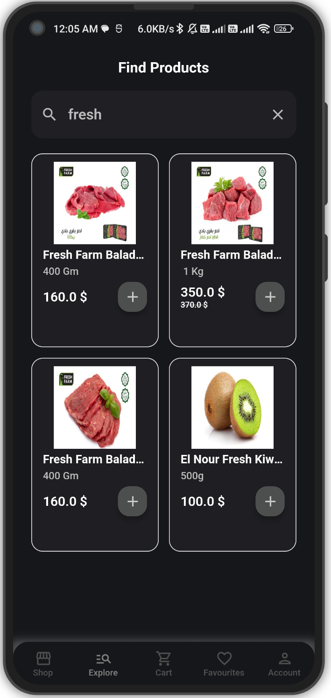</td>
      <td align="center"></td>
      <td align="center">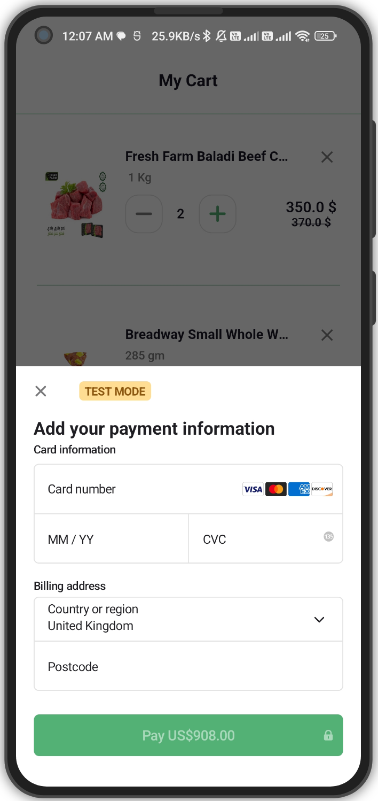</td>
    </tr>
    <tr>
      <td align="center">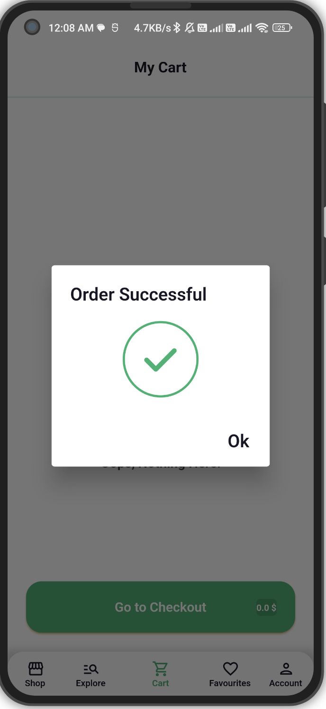</td>
      <td align="center">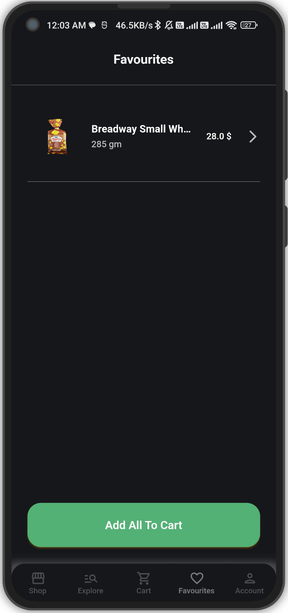</td>
      <td align="center">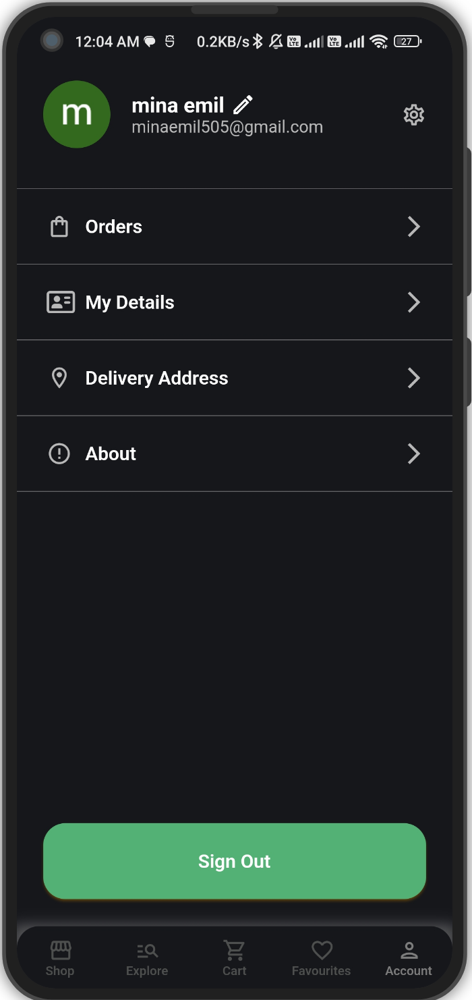</td>
    </tr>
    <tr>
      <td align="center">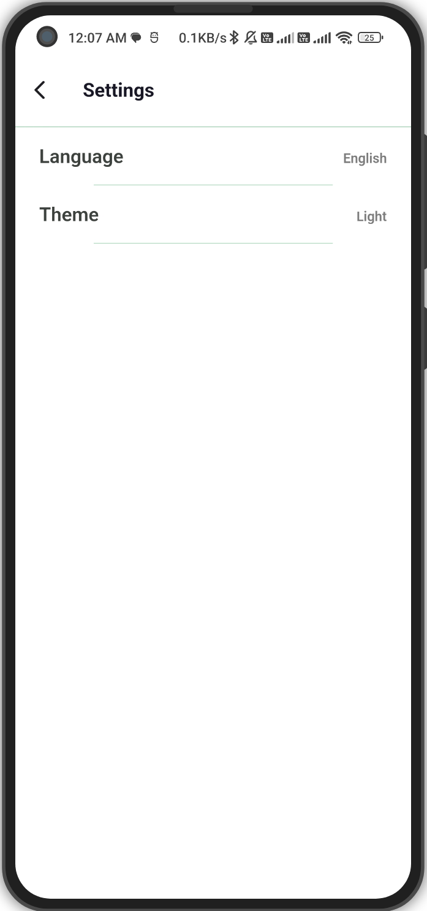</td>
      <td align="center"></td>
      <td align="center">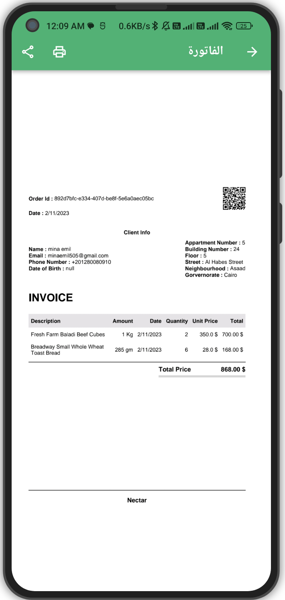</td>
    </tr>
    <tr>
      <td align="center"></td>
      <td align="center">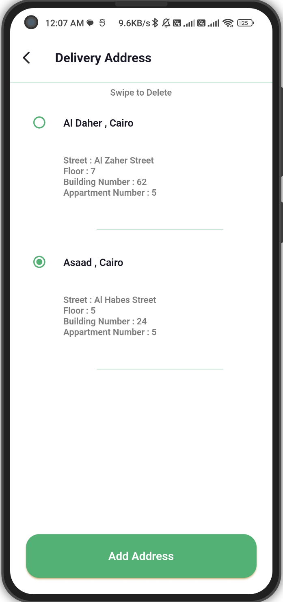</td>
      <td align="center"></td>
    </tr>
    <tr>
      <td align="center">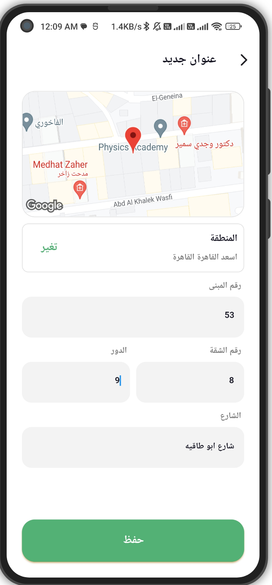</td>
      <td align="center"></td>
    </tr>
  </tbody>
</table>

  

## Packages Used 📚

The app utilizes several packages to enhance its functionality. Some of the key packages used include:

- build_runner
- cached_network_image
- country_flags
- dartz
- device_preview
- dio
- dots_indicator
- easy_localization
- equatable
- expandable
- flutter
- flutter_bloc
- flutter_dotenv
- flutter_google_places
- flutter_pdfview
- flutter_phoenix
- flutter_screenutil
- flutter_secure_storage
- flutter_slidable
- flutter_staggered_animations
- flutter_stripe
- flutter_svg
- fluttertoast
- font_awesome_flutter
- freezed
- geolocator
- get_it
- go_router
- google_maps_flutter
- google_sign_in
- hydrated_bloc
- image_picker
- json_serializable
- lottie
- open_file
- path
- path_provider
- pdf
- permission_handler
- printing
- shared_preferences
- shimmer
- twilio_flutter

These packages are crucial for enabling various functionalities and enhancing the app's capabilities.

<h2 id="team-section" align="center">Introducing the Innovative Team Behind the Project 🌟</h2> 

  <table align = "center">
    <tr>
      <td align="center"><a href="https://github.com/mina329"> <b>Mina Emil</b></a> Flutter Developer</td>
      <td align="center"><a href="https://github.com/minasaad47"> <b>Mina Saad</b></a> Full Stack Developer</td>
    </tr>
  </table>

  

